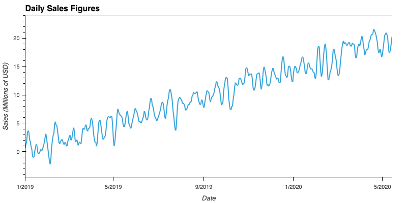

# Module11

mercado_trends Data for May 2020

<plot>
  <tr>
    <td colspan="2">  </td>
  </tr>
  
  traffic  heatmap
  <plot>
  <tr>
    <td colspan="2">  </td>
  </tr>

Weekly Trends index
  <plot>
  <tr>
    <td colspan="2">  </td>
  </tr>
Mercado Libre Closing Prices
  <plot>
  <tr>
    <td colspan="2">  </td>
  </tr>

the close and Search Trends data
 <plot>
  <tr>
    <td colspan="2">  </td>
  </tr>
 <plot>
  <tr>
    <td colspan="2">  </td>
  </tr>  

Stock Volatility
<plot>
  <tr>
    <td colspan="2">  </td>
  </tr>

Mercado trends data
<plot>
  <tr>
    <td colspan="2">  </td>
  </tr>
Daily Sale Figures
<plot>
  <tr>
    <td colspan="2">  </td>
  </tr>

seasonal patterns in the company's revenue
<plot>
  <tr>
    <td colspan="2">  </td>
  </tr>
Mercado Sales Forecast for Next Quarter
<plot>
  <tr>
    <td colspan="2">  </td>
  </tr>

 

